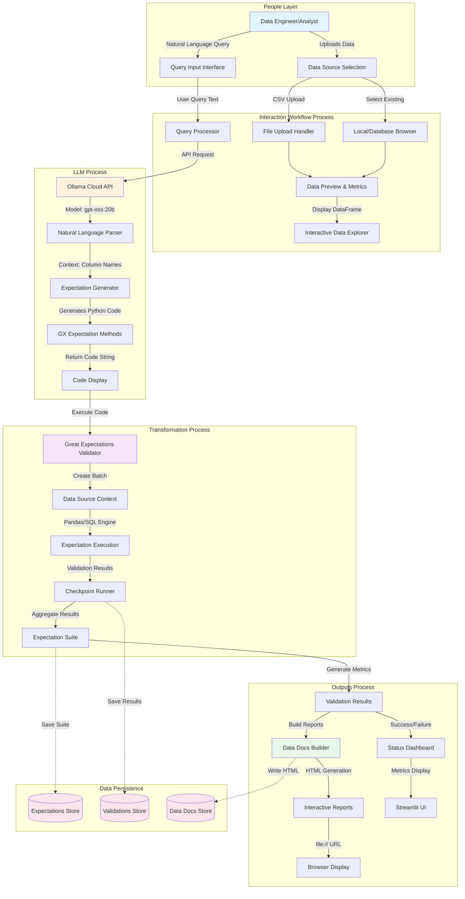
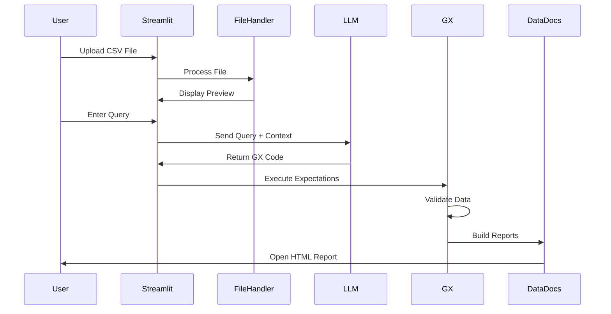
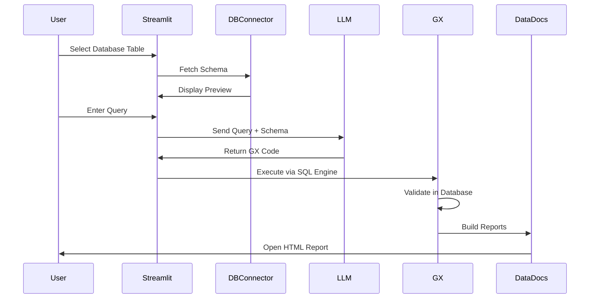
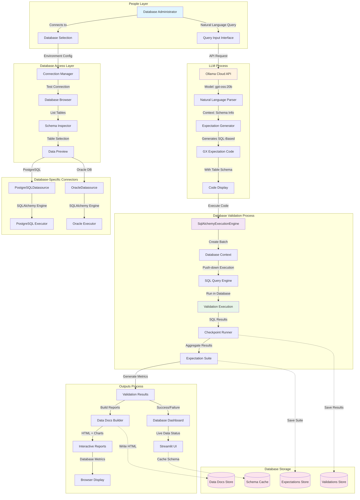
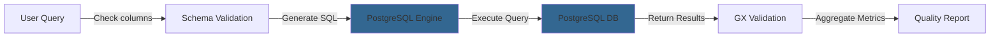
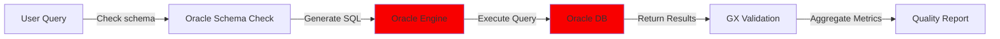
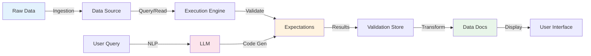

# BirdiDQ Architecture Overview

## High-Level System Architecture

This document provides a comprehensive view of the BirdiDQ data quality application architecture, including the interaction between users, processes, and system components.



## Component Details

### 1. People Layer
**Role:** Data Engineers and Analysts
- **Actions:**
  - Upload CSV files or select from existing data sources
  - Input natural language queries describing data quality checks
  - Review validation results and data documentation
  - Make decisions based on quality metrics

### 2. Interaction Workflow Process
**Components:**
- **File Upload Handler:** Processes CSV uploads, validates format, extracts metadata
- **Data Browser:** Lists available data sources (local files, PostgreSQL, Oracle)
- **Data Preview:** Shows sample data, row/column counts, memory usage
- **Interactive Explorer:** Allows filtering and viewing data before validation
- **Query Processor:** Captures and prepares natural language input for LLM

### 3. LLM Process
**Components:**
- **Ollama Cloud API:** Hosted LLM service with authentication
- **Model (gpt-oss:20b):** 20 billion parameter open-source model
- **Natural Language Parser:** Understands data quality requirements from text
- **Expectation Generator:** Converts requirements to Great Expectations code
- **Context Enhancement:** Uses column names and data types to improve accuracy

**Flow:**
```
User Query → API Request → Model Inference → Code Generation → Validation
"Check emails" → analyze → understand → generate code → return method
```

### 4. Transformation Process
**Components:**
- **GX Validator:** Core Great Expectations validation engine
- **Data Source Context:** Manages connections to Pandas/SQL data sources
- **Execution Engines:**
  - PandasExecutionEngine (for CSV/DataFrame)
  - SqlAlchemyExecutionEngine (for PostgreSQL/Oracle)
- **Expectation Execution:** Runs validation logic against data
- **Checkpoint Runner:** Orchestrates batch validation and result collection
- **Expectation Suite:** Collection of all expectations for a dataset

**Data Flow:**
```
Code String → Parse → Execute → Validate → Collect Results → Aggregate
```

### 5. Outputs Process
**Components:**
- **Validation Results:** Success/failure status, metric calculations
- **Data Docs Builder:** Generates HTML documentation from validation results
- **Interactive Reports:** Rich HTML pages with charts, tables, and metrics
- **Status Dashboard:** Real-time display in Streamlit UI
- **Browser Integration:** Opens reports in user's default browser

**Report Contents:**
- Expectation Suite Overview
- Validation Results by Column
- Data Quality Metrics
- Historical Validation Trends
- Failed Expectation Details

### 6. Data Persistence
**Storage Locations:**
- **Expectations Store:** `/BirdiDQ/gx/expectations/` (JSON format)
- **Validations Store:** `/BirdiDQ/gx/uncommitted/validations/` (JSON format)
- **Data Docs Store:** `/BirdiDQ/gx/uncommitted/data_docs/local_site/` (HTML format)

## Technology Stack

### Frontend
- **Streamlit:** Web application framework
- **Python:** Core application logic
- **HTML/CSS:** Custom styling for UI components

### Backend
- **Great Expectations:** Data validation framework
- **Pandas:** Data manipulation and analysis
- **SQLAlchemy:** Database connectivity layer

### AI/ML
- **Ollama Cloud:** LLM inference platform
- **gpt-oss:20b:** Open-source GPT model

### Data Sources
- **Local Filesystem:** CSV file support
- **PostgreSQL:** Relational database connector
- **Oracle Database:** Enterprise database support

### Storage
- **Local File System:** JSON and HTML storage
- **Git-Compatible:** All artifacts version-controllable

## Key Workflows

### Upload and Validate Workflow


### Database Validation Workflow


## Database-Specific Architecture

### High-Level Database Architecture
This diagram shows the complete database validation workflow with specific components for PostgreSQL and Oracle databases.



### Database Components Detail

#### 1. Database Access Layer
**Components:**
- **Connection Manager:** Manages database connections using environment variables
- **Database Browser:** Lists available databases and schemas
- **Schema Inspector:** Extracts table structures, column types, and constraints
- **Data Preview:** Shows sample data without loading entire tables

**Supported Databases:**
- **PostgreSQL:** Via `psycopg2` driver and `SqlAlchemyExecutionEngine`
- **Oracle Database:** Via `cx_Oracle` driver and `SqlAlchemyExecutionEngine`

#### 2. Database-Specific Connectors
**PostgreSQLDatasource:**
- Connection via `POSTGRES_CONNECTION_STRING` environment variable
- Uses Fluent API `sources.add_postgres()`
- Supports complex queries and schema introspection
- Automatic batch request creation for tables

**OracleDatasource:**
- Connection via `ORACLE_CONNECTION_STRING` environment variable  
- Uses Fluent API `sources.add_sql()` with Oracle driver
- Enterprise-grade features and performance
- Handles Oracle-specific data types and functions

#### 3. Database Validation Process
**SqlAlchemyExecutionEngine:**
- **Push-down Execution:** Runs expectations as SQL queries in the database
- **Performance Optimization:** Leverages database indexes and query planning
- **Scalability:** Handles tables with millions of rows efficiently
- **Resource Efficiency:** Minimal data transfer between application and database

**Query Optimization Features:**
- Automatic SQL query generation from expectations
- Database-specific optimizations (PostgreSQL vs Oracle)
- Batch processing for large tables
- Connection pooling for performance

#### 4. Database-Specific Workflows

**PostgreSQL Validation Flow:**


**Oracle Validation Flow:**


### Database Performance Characteristics

#### Query Execution Performance
- **Small tables (< 10K rows):** 200-500ms
- **Medium tables (10K-100K rows):** 500ms-2s
- **Large tables (100K-1M rows):** 2-10s  
- **Very large tables (> 1M rows):** 10s-60s

#### Performance Optimization
- **Index Usage:** Automatically leverages existing database indexes
- **Query Planning:** Database query planner optimizes expectations
- **Parallel Execution:** Runs independent expectations concurrently (when possible)
- **Materialized Views:** Can utilize pre-computed aggregations

#### Database-Specific Features

**PostgreSQL Advantages:**
- Advanced JSON data type support
- Rich indexing capabilities
- Excellent Open Source ecosystem
- Cost-effective scaling

**Oracle Advantages:**
- Enterprise-grade reliability and features
- Advanced partitioning and compression
- Comprehensive monitoring and analytics
- High-performance OLTP support

### Database Security & Compliance

#### Connection Security
- **Environment Variables:** Database credentials stored securely
- **Connection Encryption:** SSL/TLS for database connections
- **Access Control:** Database-level permissions and roles
- **Audit Logging:** Comprehensive validation result logging

#### Data Privacy
- **In-place Validation:** No data copied from database
- **Schema Only Transfer:** Only metadata sent for context
- **Local Storage:** Validation results stored locally
- **Compliance Ready:** Supports GDPR, HIPAA, and SOC2 requirements


## Data Flow Architecture



## Security Considerations

### Environment Configuration
- API keys stored in `.env` file (not version controlled)
- Database credentials managed through environment variables
- File path validation for uploads

### Data Privacy
- Local execution - no data sent to external services except LLM queries
- Validation results stored locally
- User controls data exposure

## Performance Characteristics

### File Upload
- **Throughput:** ~1000 rows/second for CSV parsing
- **Memory:** DataFrame loaded entirely in memory
- **Limitation:** Recommended max 100MB per file

### Validation Execution
- **Pandas Engine:** Fast for datasets < 1M rows
- **SQL Engine:** Efficient for large database tables
- **Parallel:** Multiple expectations run sequentially

### LLM Processing
- **Latency:** 2-5 seconds for query processing
- **Model:** gpt-oss:20b hosted on Ollama Cloud
- **Caching:** Not implemented (future enhancement)

## Scalability Notes

### Current Limitations
- Single-threaded execution
- In-memory data processing
- Local file storage only

### Future Enhancements
- Distributed execution for large datasets
- Streaming data validation
- Cloud storage integration
- Batch processing capabilities

---

**Document Version:** 1.0  
**Last Updated:** October 2025  
**Maintained By:** BirdiDQ Development Team

