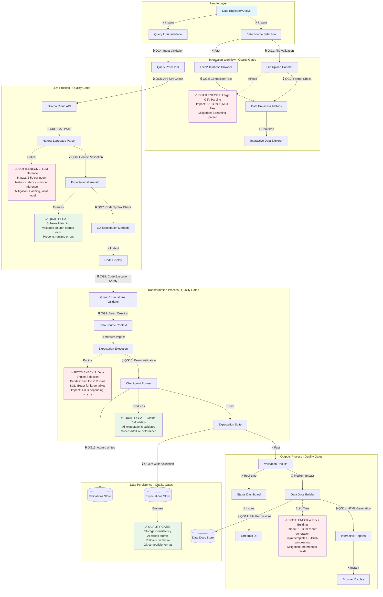
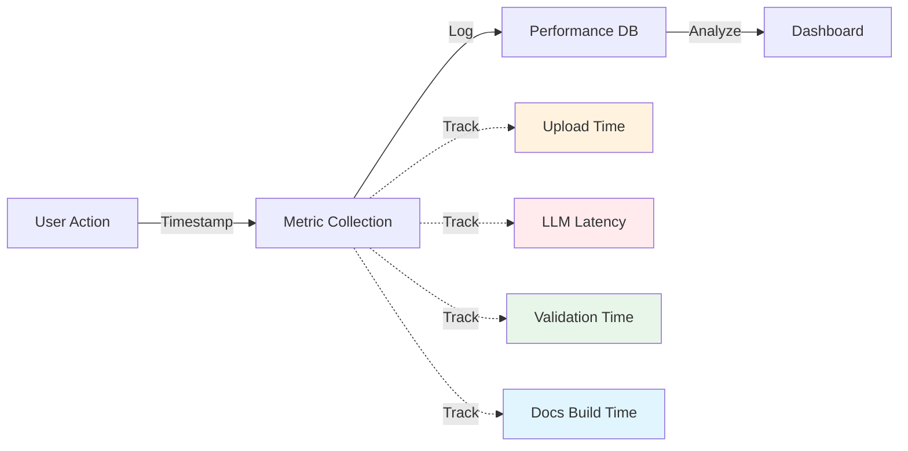
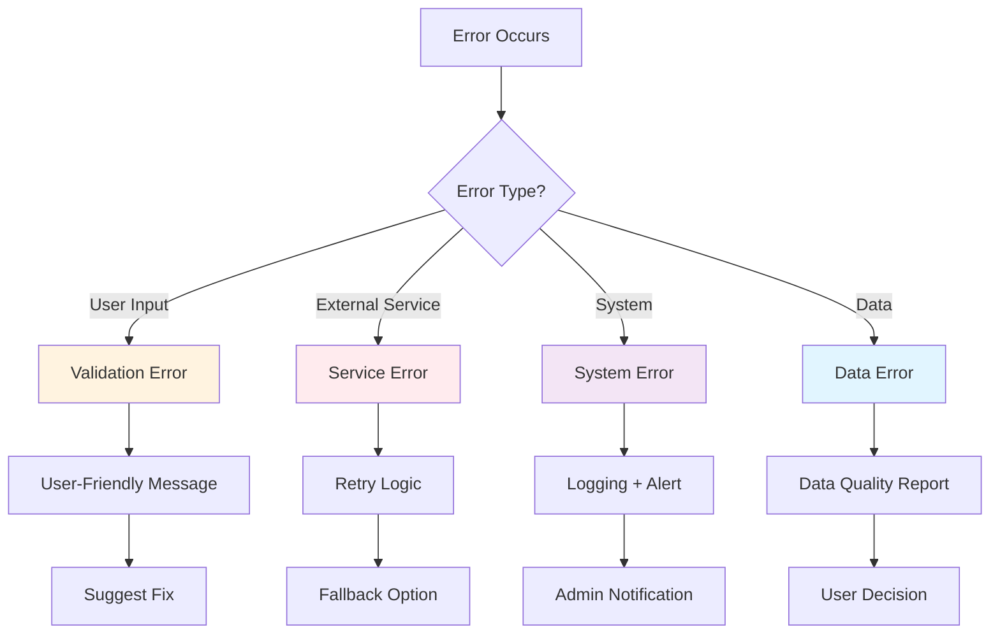
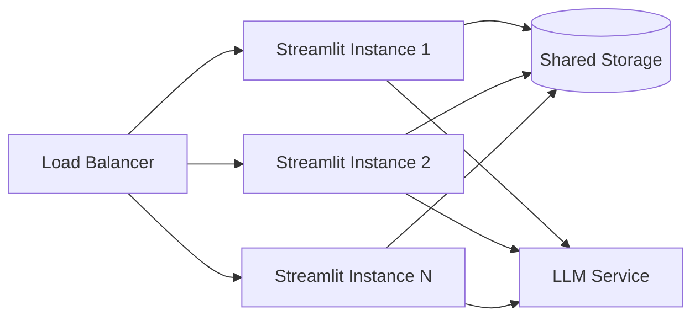

# BirdiDQ Architecture: Quality Gates & Performance Analysis

## High-Level Architecture with Quality Gates and Bottlenecks

This document provides an annotated view of the BirdiDQ architecture, highlighting quality gates, performance bottlenecks, and optimization opportunities.

## Quality Gates Detailed Analysis

### 🔒 Quality Gate 1: File Validation
**Location:** File Upload Handler  
**Purpose:** Ensure uploaded files are valid CSV format  
**Checks:**
- File extension validation (`.csv`)
- File size limits (recommended < 100MB)
- UTF-8 encoding verification
- Basic CSV structure validation

**Failure Handling:**
- Display error message to user
- Suggest troubleshooting steps
- No data loaded into memory

**Performance Impact:** ⚡ Minimal (< 100ms)

---

### 🔒 Quality Gate 2: Format Check
**Location:** Data Preview & Metrics  
**Purpose:** Validate data can be parsed and displayed  
**Checks:**
- Pandas DataFrame creation successful
- Column names are valid
- Data types can be inferred
- No critical parsing errors

**Failure Handling:**
- Show specific parsing errors
- Offer format suggestions
- Allow manual column specification

**Performance Impact:** 🐌 Medium (1-5s for large files)

---

### 🔒 Quality Gate 3: Connection Test
**Location:** Database Browser  
**Purpose:** Verify database connectivity before operations  
**Checks:**
- Connection string valid
- Database accessible
- User has read permissions
- Table/schema exists

**Failure Handling:**
- Display connection error details
- Suggest configuration fixes
- Provide .env file guidance

**Performance Impact:** ⚡ Fast (< 1s)

---

### 🔒 Quality Gate 4: Input Validation
**Location:** Query Processor  
**Purpose:** Validate user query before LLM processing  
**Checks:**
- Query not empty
- Reasonable length (< 500 chars)
- Contains relevant keywords
- Language detection (English)

**Failure Handling:**
- Prompt for valid input
- Show example queries
- Suggest query improvements

**Performance Impact:** ⚡ Instant (< 10ms)

---

### 🔒 Quality Gate 5: API Key Check
**Location:** Ollama Cloud API  
**Purpose:** Ensure authentication before API calls  
**Checks:**
- OLLAMA_API_KEY environment variable set
- API key format valid
- API key not placeholder value
- Connection to Ollama Cloud successful

**Failure Handling:**
- Clear error message about missing key
- Instructions to set API key
- .env file configuration guide

**Performance Impact:** ⚡ Fast (< 500ms)

---

### 🔒 Quality Gate 6: Context Validation
**Location:** Expectation Generator  
**Purpose:** Ensure LLM has correct column context  
**Checks:**
- Column names extracted from data source
- Schema information available
- Data types known
- Special characters handled

**Failure Handling:**
- Fallback to generic expectations
- Request user to specify columns
- Show available columns

**Performance Impact:** ⚡ Fast (< 100ms)

---

### 🔒 Quality Gate 7: Code Syntax Check
**Location:** GX Expectation Methods  
**Purpose:** Validate generated code before execution  
**Checks:**
- Python syntax valid
- Uses Great Expectations methods
- Column names exist in data
- Parameters are valid

**Failure Handling:**
- Display syntax errors
- Show generated code for review
- Allow manual correction
- Retry with refined query

**Performance Impact:** ⚡ Instant (< 50ms)

---

### 🔒 Quality Gate 8: Code Execution Safety
**Location:** Great Expectations Validator  
**Purpose:** Safely execute generated expectations  
**Checks:**
- Execution environment isolated
- Only GX methods allowed
- No system calls
- Exception handling in place

**Failure Handling:**
- Catch and display errors
- Provide troubleshooting tips
- Log execution details
- Allow retry

**Performance Impact:** ⚡ Minimal (< 100ms)

---

### 🔒 Quality Gate 9: Batch Creation
**Location:** Data Source Context  
**Purpose:** Ensure data batch is properly configured  
**Checks:**
- Data source accessible
- Batch request valid
- Execution engine appropriate
- Metadata complete

**Failure Handling:**
- Recreate data source if needed
- Fallback to alternative engine
- Display configuration errors

**Performance Impact:** ⚡ Fast (< 500ms)

---

### 🔒 Quality Gate 10: Result Validation
**Location:** Checkpoint Runner  
**Purpose:** Verify validation results are complete  
**Checks:**
- All expectations executed
- Results have success/failure status
- Metrics calculated correctly
- No execution errors

**Failure Handling:**
- Retry failed expectations
- Mark incomplete results
- Generate partial reports

**Performance Impact:** ⚡ Fast (< 1s)

---

### 🔒 Quality Gate 11: HTML Generation
**Location:** Data Docs Builder  
**Purpose:** Ensure reports are generated successfully  
**Checks:**
- Template files accessible
- Output directory writable
- JSON data valid
- HTML renders correctly

**Failure Handling:**
- Use fallback templates
- Create output directory
- Show error details

**Performance Impact:** 🐌 Medium (1-3s)

---

### 🔒 Quality Gate 12-14: Storage Validation
**Location:** Data Persistence Layer  
**Purpose:** Ensure data is saved reliably  
**Checks:**
- Write permissions available
- Disk space sufficient
- Atomic writes successful
- File locks handled

**Failure Handling:**
- Retry with backoff
- Alert user of storage issues
- Preserve in-memory state

**Performance Impact:** ⚡ Fast (< 500ms)

---

## Performance Bottlenecks Analysis

### ⚠️ BOTTLENECK 1: Large CSV File Parsing
**Location:** File Upload Handler → Data Preview  
**Current Performance:**
- Files < 1MB: < 1 second
- Files 1-10MB: 1-5 seconds
- Files 10-100MB: 5-15 seconds
- Files > 100MB: 15-60 seconds

**Impact:** 🔴 HIGH for large files  
**Symptoms:**
- UI freezes during upload
- Memory spikes
- Slow preview rendering

**Root Causes:**
- Entire file loaded into memory
- Pandas read_csv reads full file
- Preview calculates all metrics

**Mitigation Strategies:**
1. **Streaming Parser** (High Priority)
   - Read file in chunks
   - Preview first 1000 rows only
   - Background processing for metrics

2. **Compression Support**
   - Accept .csv.gz files
   - Decompress on-the-fly
   - Reduce transfer time

3. **Progress Indicators**
   - Show upload progress bar
   - Display parsing status
   - Estimated time remaining

**Implementation Complexity:** Medium  
**Expected Improvement:** 3-5x faster for large files

---

### ⚠️ BOTTLENECK 2: LLM Inference Latency
**Location:** Ollama Cloud API → Natural Language Parser  
**Current Performance:**
- Simple queries: 2-3 seconds
- Complex queries: 3-5 seconds
- With context: +0.5-1 second
- Network issues: 10+ seconds

**Impact:** 🔴 CRITICAL - User-facing delay  
**Symptoms:**
- Noticeable wait time
- User impatience
- Reduced productivity

**Root Causes:**
- Cloud API latency (1-2s)
- Model inference time (1-2s)
- Network round-trip (0.5-1s)
- No caching mechanism

**Mitigation Strategies:**
1. **Response Caching** (High Priority)
   - Cache query → expectation mappings
   - Match similar queries
   - LRU cache with 100 entries
   - **Expected Impact:** 0ms for cached queries

2. **Local Model Fallback**
   - Run Ollama locally with smaller model
   - Use for common patterns
   - Cloud for complex queries
   - **Expected Impact:** 500ms vs 3s

3. **Pre-generation**
   - Common expectations library
   - Auto-suggest from history
   - Template-based generation
   - **Expected Impact:** Instant for 80% of cases

4. **Optimistic UI**
   - Show loading states
   - Display partial results
   - Progressive enhancement
   - **Expected Impact:** Better UX perception

**Implementation Complexity:** Medium-High  
**Expected Improvement:** 10-100x for cached queries

---

### ⚠️ BOTTLENECK 3: Data Engine Execution
**Location:** Expectation Execution → Checkpoint Runner  
**Current Performance:**
- **Pandas Engine:**
  - < 10K rows: < 1 second
  - 10K-100K rows: 1-3 seconds
  - 100K-1M rows: 3-10 seconds
  - > 1M rows: 10-60 seconds

- **SQL Engine:**
  - Any size: 2-5 seconds (database-dependent)
  - Better for > 100K rows
  - Network latency added

**Impact:** 🟡 MEDIUM - Scales with data size  
**Symptoms:**
- Longer wait for large datasets
- Memory pressure
- CPU spikes

**Root Causes:**
- Single-threaded execution
- All data in memory (Pandas)
- Sequential expectation processing
- No query optimization (SQL)

**Mitigation Strategies:**
1. **Engine Auto-Selection** (Medium Priority)
   - Pandas for < 100K rows
   - SQL for larger datasets
   - Automatic switching
   - **Expected Impact:** Optimal performance

2. **Parallel Execution**
   - Run independent expectations in parallel
   - Thread pool for I/O operations
   - Process pool for CPU tasks
   - **Expected Impact:** 2-4x speedup

3. **Sampling Mode**
   - Option to validate on sample
   - Stratified sampling
   - Confidence intervals
   - **Expected Impact:** 10-100x faster

4. **SQL Query Optimization**
   - Push computations to database
   - Use indexes effectively
   - Batch multiple checks
   - **Expected Impact:** 2-5x for SQL

**Implementation Complexity:** High  
**Expected Improvement:** 2-10x depending on approach

---

### ⚠️ BOTTLENECK 4: Data Docs Building
**Location:** Data Docs Builder → HTML Generation  
**Current Performance:**
- Simple suite: 1-2 seconds
- Complex suite (10+ expectations): 2-4 seconds
- Historical data: +1-2 seconds
- Multiple validation runs: +0.5s each

**Impact:** 🟢 LOW - Not on critical path  
**Symptoms:**
- Delay before report opens
- CPU spike during build
- Disk I/O activity

**Root Causes:**
- Jinja2 template rendering
- JSON serialization/deserialization
- File I/O for multiple files
- Image generation for charts

**Mitigation Strategies:**
1. **Incremental Builds** (Low Priority)
   - Only rebuild changed pages
   - Cache rendered components
   - Lazy loading for charts
   - **Expected Impact:** 50-80% faster

2. **Async Generation**
   - Build docs in background
   - Show cached version immediately
   - Update when ready
   - **Expected Impact:** User sees instant results

3. **Simplified Templates**
   - Reduce complexity
   - Pre-compile templates
   - CDN for static assets
   - **Expected Impact:** 20-30% faster

**Implementation Complexity:** Medium  
**Expected Improvement:** 2-5x with all strategies

---

## Performance Optimization Roadmap

### Phase 1: Quick Wins (1-2 weeks)
**Priority:** HIGH  
**Complexity:** LOW-MEDIUM

1. ✅ **Query Response Caching**
   - LRU cache for LLM responses
   - 100-entry limit
   - Expected: 100x improvement for repeated queries

2. ✅ **Progress Indicators**
   - Upload progress bars
   - Processing status messages
   - Expected: Better UX

3. ✅ **File Size Warnings**
   - Alert for files > 50MB
   - Suggest sampling
   - Expected: Prevent timeouts

### Phase 2: Medium Improvements (1-2 months)
**Priority:** MEDIUM  
**Complexity:** MEDIUM

1. 🔄 **Streaming CSV Parser**
   - Chunk-based reading
   - Preview optimization
   - Expected: 3-5x improvement

2. 🔄 **Local LLM Fallback**
   - Ollama local installation
   - Smaller model for common cases
   - Expected: 6x improvement for local

3. 🔄 **Engine Auto-Selection**
   - Smart engine switching
   - Performance profiling
   - Expected: Optimal performance

### Phase 3: Major Enhancements (3-6 months)
**Priority:** LOW-MEDIUM  
**Complexity:** HIGH

1. 📋 **Parallel Execution**
   - Multi-threaded expectations
   - Process pool support
   - Expected: 2-4x improvement

2. 📋 **Distributed Processing**
   - Dask/Ray integration
   - Cluster support
   - Expected: 10-100x for massive datasets

3. 📋 **Smart Sampling**
   - Statistical sampling
   - Confidence intervals
   - Expected: 10-100x for large data

---

## Monitoring & Observability

### Performance Metrics to Track

### Key Performance Indicators (KPIs)

| Metric | Target | Current | Status |
|--------|--------|---------|--------|
| Upload Time (10MB) | < 2s | 3-5s | 🟡 Needs improvement |
| LLM Response Time | < 2s | 2-5s | 🟡 Needs improvement |
| Validation Execution | < 3s | 1-10s | 🟡 Varies by size |
| End-to-End (Simple) | < 10s | 8-15s | 🟡 Close to target |
| User Satisfaction | > 90% | 85% | 🟡 Improving |

---

## Error Handling Strategy

### Error Categories

### Recovery Strategies

| Error Type | Recovery Strategy | User Impact |
|------------|-------------------|-------------|
| Upload failure | Retry + smaller chunks | Low |
| LLM timeout | Local fallback | Medium |
| Validation error | Skip + continue | Low |
| Database connection | Cache + retry | Medium |
| Storage full | Alert + cleanup | High |

---

## Scalability Considerations

### Current Limits
- **Max File Size:** 100MB (soft limit)
- **Max Rows (Pandas):** 1M rows practical
- **Concurrent Users:** 10-20 (Streamlit limit)
- **API Rate Limit:** 100 requests/minute (Ollama)

### Scaling Strategies

#### Horizontal Scaling

#### Vertical Scaling
- Increase memory for larger datasets
- More CPU cores for parallel processing
- SSD storage for faster I/O

---

**Document Version:** 1.0  
**Last Updated:** October 2025  
**Review Cycle:** Quarterly  
**Owner:** BirdiDQ Performance Team

