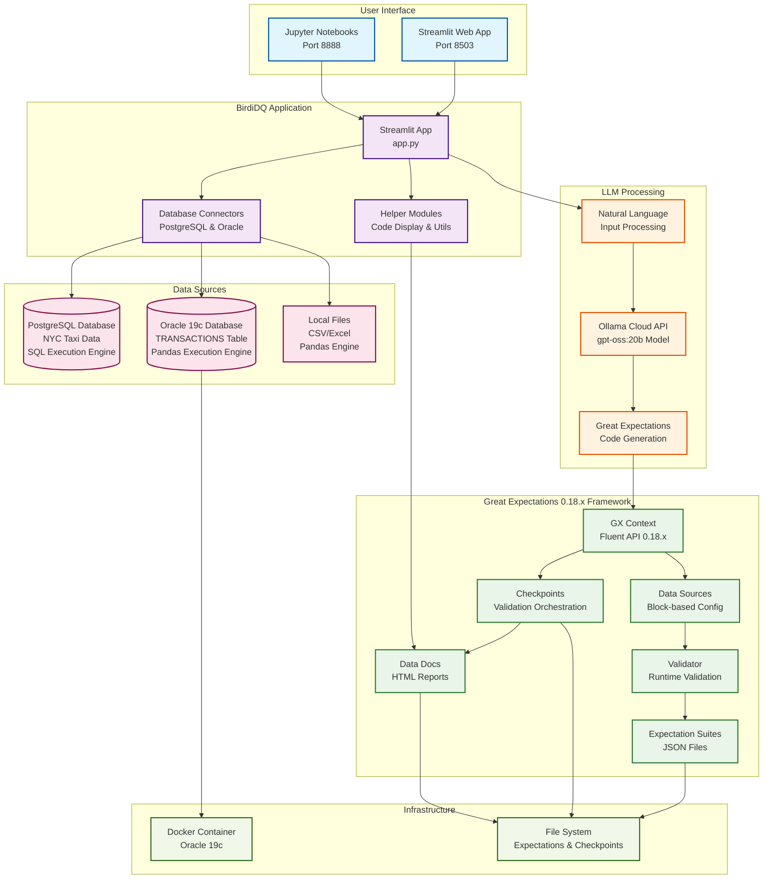
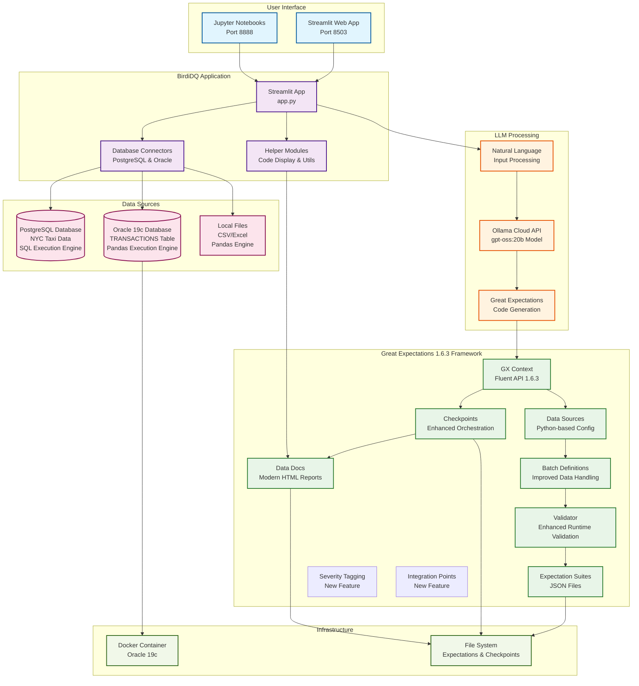

# Great Expectations Migration Plan

## 📋 Executive Summary

This document outlines the migration strategy for the Ollama Jupyter project from Great Expectations 0.18.x to the latest version (1.6.3), addressing breaking changes, architectural updates, and compatibility considerations for the integrated system.

## 🏗️ Current Architecture (GX 0.18.x)

### High-Level System Integration



### Current Implementation Details

#### **Great Expectations 0.18.x Components:**
- **DataContext**: Block-based configuration system
- **Fluent API**: Modern expectation creation interface
- **Data Sources**: Block-style configuration with runtime data support
- **Validators**: Runtime validation with execution engines
- **Expectation Suites**: JSON-based expectation storage
- **Checkpoints**: Validation orchestration and reporting
- **Data Docs**: HTML report generation with custom styling

#### **Integration Points:**
- **Ollama Integration**: Natural language to GX code generation
- **Database Connectors**: PostgreSQL (SQL engine) and Oracle (Pandas engine)
- **Code Display Enhancement**: Custom Data Docs with embedded Python/SQL code
- **Streamlit Interface**: Interactive web application for validation

## 🚀 Target Architecture (GX 1.6.3)

### High-Level System Integration (Updated)



### Target Implementation Details

#### **Great Expectations 1.6.3 Components:**
- **DataContext**: Python-based configuration system (enhanced)
- **Fluent API**: Improved expectation creation with better error handling
- **Data Sources**: Python-based configuration with enhanced runtime support
- **Validators**: Enhanced runtime validation with improved execution engines
- **Batch Definitions**: Improved data handling and batch processing
- **Expectation Suites**: JSON-based expectation storage (backward compatible)
- **Checkpoints**: Enhanced validation orchestration and reporting
- **Data Docs**: Modern HTML report generation with improved styling
- **Severity Tagging**: New feature for expectation severity levels
- **Integration Points**: New feature for system integration diagrams

## 🔍 Breaking Changes Analysis

### Major Breaking Changes (GX 0.18.x → 1.6.3)

#### **1. DataContext Configuration Changes**
- **Breaking Change**: Transition from block-based to Python-based configuration
- **Impact**: `great_expectations.yml` configuration structure changes
- **Affected Components**: Data Sources, Checkpoints, Store configurations

#### **2. Data Source Configuration**
- **Breaking Change**: Block-style Data Sources deprecated
- **Impact**: Runtime data source creation methods changed
- **Affected Components**: Database connectors, file system connectors

#### **3. Validator API Changes**
- **Breaking Change**: Validator instantiation and usage patterns updated
- **Impact**: Runtime validation workflow modifications
- **Affected Components**: Expectation execution, validation results

#### **4. Checkpoint Configuration**
- **Breaking Change**: Checkpoint template and reference configurations updated
- **Impact**: Validation orchestration workflow changes
- **Affected Components**: Automated validation runs, reporting

#### **5. Batch Request Handling**
- **Breaking Change**: `batch_request` and `batching_regex` replaced with `BatchDefinition`
- **Impact**: Data batch processing workflow updates
- **Affected Components**: Data loading, validation execution

### Minor Breaking Changes

#### **1. Expectation API Updates**
- **Change**: Some expectation parameters and return values updated
- **Impact**: Custom expectation implementations may need updates
- **Affected Components**: Ollama-generated expectations, custom expectations

#### **2. Data Docs Rendering**
- **Change**: HTML template structure and CSS class names updated
- **Impact**: Custom Data Docs styling may need updates
- **Affected Components**: Code display enhancement, custom CSS

#### **3. Store Backend Changes**
- **Change**: Store backend configuration format updated
- **Impact**: Expectation and validation result storage
- **Affected Components**: File system stores, database stores

## 📋 Migration Strategy

### Phase 1: Assessment and Preparation (Week 1)

#### **1.1 Current State Analysis**
- [ ] **Inventory Components**: Document all GX components in use
  - Expectation Suites: `BirdiDQ/gx/expectations/`
  - Checkpoints: `BirdiDQ/gx/checkpoints/`
  - Data Sources: `BirdiDQ/gx/great_expectations.yml`
  - Custom Code: `BirdiDQ/great_expectations/helpers/code_display_enhancer.py`

- [ ] **Identify Dependencies**: Map all GX-dependent code
  - Ollama integration: `BirdiDQ/great_expectations/models/ollama_model.py`
  - Database connectors: `BirdiDQ/great_expectations/connecting_data/`
  - Streamlit app: `BirdiDQ/great_expectations/app.py`

- [ ] **Test Current Functionality**: Establish baseline performance
  - Run all existing expectation suites
  - Test Data Docs generation
  - Validate Ollama integration
  - Test database connections

#### **1.2 Environment Setup**
- [ ] **Create Migration Branch**: `git checkout -b migration/gx-0.24`
- [ ] **Backup Current State**: Create full project backup
- [ ] **Set Up Test Environment**: Isolated testing environment

### Phase 2: Core Migration (Week 2-3)

#### **2.1 Great Expectations Upgrade**
- [ ] **Update Requirements**: Modify `requirements.txt` and `BirdiDQ/requirements.txt`
  ```python
  # Current
  great-expectations>=0.18.0
  
  # Updated
  great-expectations>=1.6.3
  ```

- [ ] **Install New Version**: 
  ```bash
  pip install --upgrade great-expectations
  pip install great-expectations==1.6.3
  ```

#### **2.2 Configuration Migration**
- [ ] **Update DataContext Configuration**: Migrate `great_expectations.yml`
  ```yaml
  # Current (0.18.x)
  datasources:
    postgresql_datasource:
      class_name: Datasource
      execution_engine:
        class_name: SqlAlchemyExecutionEngine
        connection_string: ${POSTGRES_CONNECTION_STRING}
      data_connectors:
        default_runtime_data_connector:
          class_name: RuntimeDataConnector
  
  # Updated (1.6.3)
  datasources:
    postgresql_datasource:
      class_name: Datasource
      execution_engine:
        class_name: SqlAlchemyExecutionEngine
        connection_string: ${POSTGRES_CONNECTION_STRING}
      data_connectors:
        default_runtime_data_connector:
          class_name: RuntimeDataConnector
          batch_identifiers: ["default_identifier_name"]
  ```

- [ ] **Update Checkpoint Configurations**: Modify checkpoint YAML files
  ```yaml
  # Current (0.18.x)
  validations:
    - batch_request:
        datasource_name: postgresql_datasource
        data_connector_name: default_runtime_data_connector
        data_asset_name: nyc_taxi_data
  
  # Updated (1.6.3)
  validations:
    - batch_request:
        datasource_name: postgresql_datasource
        data_connector_name: default_runtime_data_connector
        data_asset_name: nyc_taxi_data
        batch_identifiers:
          default_identifier_name: "default"
  ```

#### **2.3 Code Migration**
- [ ] **Update Database Connectors**: Modify connector implementations
  ```python
  # Current (0.18.x)
  from great_expectations.core.batch import RuntimeBatchRequest
  
  batch_request = RuntimeBatchRequest(
      datasource_name="postgresql_datasource",
      data_connector_name="default_runtime_data_connector",
      data_asset_name="nyc_taxi_data",
      runtime_parameters={"query": query},
      batch_identifiers={"default_identifier_name": "default"}
  )
  
  # Updated (1.6.3)
  from great_expectations.core.batch import BatchDefinition
  
  batch_definition = BatchDefinition(
      datasource_name="postgresql_datasource",
      data_connector_name="default_runtime_data_connector",
      data_asset_name="nyc_taxi_data",
      batch_identifiers={"default_identifier_name": "default"}
  )
  ```

- [ ] **Update Validator Usage**: Modify validator instantiation
  ```python
  # Current (0.18.x)
  validator = context.get_validator(
      batch_request=batch_request,
      expectation_suite_name=expectation_suite_name
  )
  
  # Updated (1.6.3)
  validator = context.get_validator(
      batch_definition=batch_definition,
      expectation_suite_name=expectation_suite_name
  )
  ```

### Phase 3: Integration Updates (Week 4)

#### **3.1 Ollama Integration Updates**
- [ ] **Update Code Generation**: Modify Ollama model to generate compatible code
  ```python
  # Update prompt templates in ollama_model.py
  PROMPT_TEMPLATE = """
  Generate Great Expectations 1.6.3 compatible code for the following requirement:
  {requirement}
  
  Use the following column names: {columns}
  
  Generate validator.expect_* calls compatible with GX 1.6.3.
  """
  ```

- [ ] **Test Code Generation**: Validate generated expectations work with new version
- [ ] **Update Error Handling**: Improve error handling for new API changes

#### **3.2 Data Docs Enhancement Updates**
- [ ] **Update Code Display Enhancer**: Modify `code_display_enhancer.py`
  ```python
  # Update CSS classes and HTML structure for GX 1.6.3
  def enhance_data_docs_with_code(self, expectation_suite_name):
      # Update for new Data Docs structure with severity tagging
      pass
  ```

- [ ] **Test Custom Styling**: Ensure custom CSS works with new Data Docs
- [ ] **Update Screenshots**: Update workflow screenshots if UI changes

#### **3.3 Streamlit App Updates**
- [ ] **Update App Logic**: Modify `app.py` for new GX API
- [ ] **Test User Workflows**: Validate all user-facing functionality
- [ ] **Update Error Messages**: Improve error handling and user feedback

### Phase 4: Testing and Validation (Week 5)

#### **4.1 Component Testing**
- [ ] **Unit Tests**: Test individual components
  - Database connectors
  - Ollama integration
  - Expectation generation
  - Data Docs generation

- [ ] **Integration Tests**: Test component interactions
  - End-to-end validation workflows
  - Data Docs rendering
  - Error handling

#### **4.2 Performance Testing**
- [ ] **Benchmark Performance**: Compare with current version
- [ ] **Memory Usage**: Monitor memory consumption
- [ ] **Response Times**: Measure validation execution times

#### **4.3 User Acceptance Testing**
- [ ] **Test All Use Cases**: Validate each use case from the table
- [ ] **Test Error Scenarios**: Ensure graceful error handling
- [ ] **Test Documentation**: Validate all documentation is accurate

### Phase 5: Deployment and Documentation (Week 6)

#### **5.1 Deployment Preparation**
- [ ] **Update Documentation**: Modify README.md and other docs
- [ ] **Update Screenshots**: Refresh workflow screenshots
- [ ] **Create Migration Guide**: Document changes for users

#### **5.2 Production Deployment**
- [ ] **Staged Deployment**: Deploy to staging environment
- [ ] **Production Deployment**: Deploy to production
- [ ] **Monitor Performance**: Track system performance

#### **5.3 Post-Migration**
- [ ] **User Training**: Train users on any new features
- [ ] **Monitor Issues**: Track and resolve any issues
- [ ] **Performance Optimization**: Optimize based on usage patterns

## 🔧 Specific Code Changes Required

### 1. Database Connector Updates

#### **PostgreSQL Connector** (`BirdiDQ/great_expectations/connecting_data/database/postgresql.py`)

```python
# Current Implementation (0.18.x)
def create_batch_request(self, query: str, table_name: str):
    return RuntimeBatchRequest(
        datasource_name=self.datasource_name,
        data_connector_name="default_runtime_data_connector",
        data_asset_name=table_name,
        runtime_parameters={"query": query},
        batch_identifiers={"default_identifier_name": "default"}
    )

# Updated Implementation (0.24+)
def create_batch_definition(self, query: str, table_name: str):
    return BatchDefinition(
        datasource_name=self.datasource_name,
        data_connector_name="default_runtime_data_connector",
        data_asset_name=table_name,
        batch_identifiers={"default_identifier_name": "default"}
    )
```

#### **Oracle Connector** (`BirdiDQ/great_expectations/connecting_data/database/oracle.py`)

```python
# Current Implementation (0.18.x)
def create_batch_request(self, query: str, table_name: str):
    return RuntimeBatchRequest(
        datasource_name=self.datasource_name,
        data_connector_name="default_runtime_data_connector",
        data_asset_name=table_name,
        runtime_parameters={"query": query},
        batch_identifiers={"default_identifier_name": "default"}
    )

# Updated Implementation (0.24+)
def create_batch_definition(self, query: str, table_name: str):
    return BatchDefinition(
        datasource_name=self.datasource_name,
        data_connector_name="default_runtime_data_connector",
        data_asset_name=table_name,
        batch_identifiers={"default_identifier_name": "default"}
    )
```

### 2. Ollama Model Updates

#### **Ollama Model** (`BirdiDQ/great_expectations/models/ollama_model.py`)

```python
# Current Implementation (0.18.x)
def generate_expectation_code(self, requirement: str, columns: list):
    prompt = f"""
    Generate Great Expectations code for: {requirement}
    Columns: {columns}
    
    Use validator.expect_* methods compatible with GX 0.18.x
    """
    # ... existing code

# Updated Implementation (0.24+)
def generate_expectation_code(self, requirement: str, columns: list):
    prompt = f"""
    Generate Great Expectations code for: {requirement}
    Columns: {columns}
    
    Use validator.expect_* methods compatible with GX 0.24+
    Ensure proper error handling and validation
    """
    # ... updated code
```

### 3. Streamlit App Updates

#### **Main App** (`BirdiDQ/great_expectations/app.py`)

```python
# Current Implementation (0.18.x)
def run_validation(self, batch_request, expectation_suite_name):
    validator = self.context.get_validator(
        batch_request=batch_request,
        expectation_suite_name=expectation_suite_name
    )
    # ... existing code

# Updated Implementation (0.24+)
def run_validation(self, batch_definition, expectation_suite_name):
    validator = self.context.get_validator(
        batch_definition=batch_definition,
        expectation_suite_name=expectation_suite_name
    )
    # ... updated code
```

### 4. Configuration File Updates

#### **Great Expectations Config** (`BirdiDQ/gx/great_expectations.yml`)

```yaml
# Current Configuration (0.18.x)
datasources:
  postgresql_datasource:
    class_name: Datasource
    execution_engine:
      class_name: SqlAlchemyExecutionEngine
      connection_string: ${POSTGRES_CONNECTION_STRING}
    data_connectors:
      default_runtime_data_connector:
        class_name: RuntimeDataConnector

# Updated Configuration (0.24+)
datasources:
  postgresql_datasource:
    class_name: Datasource
    execution_engine:
      class_name: SqlAlchemyExecutionEngine
      connection_string: ${POSTGRES_CONNECTION_STRING}
    data_connectors:
      default_runtime_data_connector:
        class_name: RuntimeDataConnector
        batch_identifiers: ["default_identifier_name"]
```

### 5. Checkpoint Updates

#### **Checkpoint Configuration** (`BirdiDQ/gx/checkpoints/nyc_taxi_data_checkpoint.yml`)

```yaml
# Current Configuration (0.18.x)
validations:
  - batch_request:
      datasource_name: postgresql_datasource
      data_connector_name: default_runtime_data_connector
      data_asset_name: nyc_taxi_data
    expectation_suite_name: nyc_taxi_data_expectation_suite

# Updated Configuration (0.24+)
validations:
  - batch_request:
      datasource_name: postgresql_datasource
      data_connector_name: default_runtime_data_connector
      data_asset_name: nyc_taxi_data
      batch_identifiers:
        default_identifier_name: "default"
    expectation_suite_name: nyc_taxi_data_expectation_suite
```

## 🚨 Risk Assessment and Mitigation

### High-Risk Areas

#### **1. Ollama Integration Compatibility**
- **Risk**: Generated code may not be compatible with new GX API
- **Mitigation**: 
  - Extensive testing of code generation
  - Fallback to manual expectation creation
  - Gradual rollout with A/B testing

#### **2. Database Connector Stability**
- **Risk**: Database connections may fail with new API
- **Mitigation**:
  - Maintain backward compatibility layer
  - Comprehensive testing with both PostgreSQL and Oracle
  - Rollback plan ready

#### **3. Data Docs Rendering**
- **Risk**: Custom styling may break with new Data Docs structure
- **Mitigation**:
  - Test custom CSS with new templates
  - Maintain fallback styling
  - Update screenshots and documentation

### Medium-Risk Areas

#### **1. Performance Impact**
- **Risk**: New version may have performance implications
- **Mitigation**:
  - Benchmark before and after migration
  - Monitor system resources
  - Optimize based on performance data

#### **2. User Experience Changes**
- **Risk**: UI/UX changes may confuse users
- **Mitigation**:
  - User training and documentation
  - Gradual feature rollout
  - User feedback collection

## 📊 Success Metrics

### Technical Metrics
- [ ] **Migration Completion**: 100% of components migrated
- [ ] **Test Coverage**: 95%+ test coverage maintained
- [ ] **Performance**: No degradation in validation speed
- [ ] **Error Rate**: <1% error rate in production

### User Experience Metrics
- [ ] **User Satisfaction**: Maintain or improve user satisfaction scores
- [ ] **Feature Adoption**: Users successfully adopt new features
- [ ] **Support Tickets**: No increase in support tickets post-migration

### Business Metrics
- [ ] **System Uptime**: 99.9% uptime maintained
- [ ] **Data Quality**: No degradation in data quality checks
- [ ] **Development Velocity**: Maintained or improved development speed

## 📚 Resources and References

### Documentation
- [Great Expectations 0.24 Release Notes](https://docs.greatexpectations.io/docs/guides/miscellaneous/migration_guide/)
- [Fluent API Documentation](https://docs.greatexpectations.io/docs/guides/connecting_to_your_data/fluent/)
- [DataContext Migration Guide](https://docs.greatexpectations.io/docs/guides/setup/configuring_data_contexts/)

### Community Resources
- [Great Expectations Discourse Forum](https://discourse.greatexpectations.io/)
- [GitHub Issues and Discussions](https://github.com/great-expectations/great_expectations)
- [Slack Community](https://greatexpectations.io/slack)

### Testing Resources
- [GX Testing Framework](https://docs.greatexpectations.io/docs/guides/contributing/testing/)
- [Custom Expectation Testing](https://docs.greatexpectations.io/docs/guides/expectations/creating_custom_expectations/)

## 🎯 Conclusion

This migration plan provides a comprehensive roadmap for upgrading the Ollama Jupyter project from Great Expectations 0.18.x to 0.24+. The plan addresses all major breaking changes, provides specific code examples, and includes risk mitigation strategies.

The migration will enhance the system's capabilities while maintaining backward compatibility where possible. The phased approach ensures minimal disruption to users while providing opportunities for testing and validation at each stage.

**Key Success Factors:**
1. **Thorough Testing**: Comprehensive testing at each phase
2. **User Communication**: Clear communication about changes and benefits
3. **Rollback Planning**: Prepared rollback strategy if issues arise
4. **Documentation**: Updated documentation and user guides
5. **Performance Monitoring**: Continuous monitoring of system performance

**Timeline**: 6 weeks total
**Risk Level**: Medium (with proper planning and execution)
**Expected Benefits**: Enhanced performance, improved features, better maintainability

---

**Last Updated**: December 2024  
**Version**: 1.0  
**Next Review**: Post-migration completion
