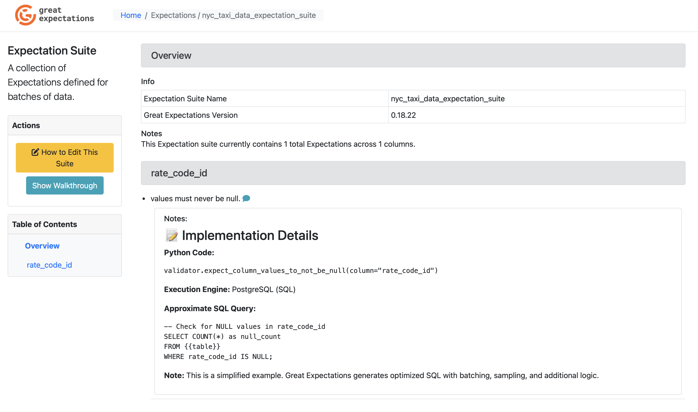
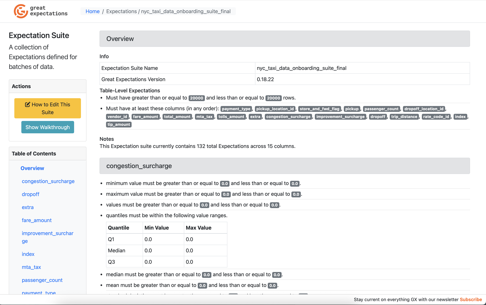
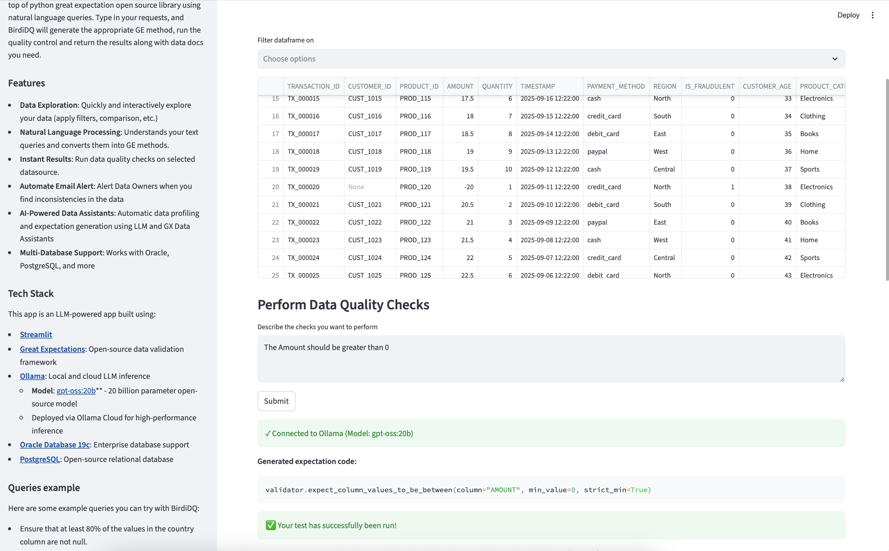
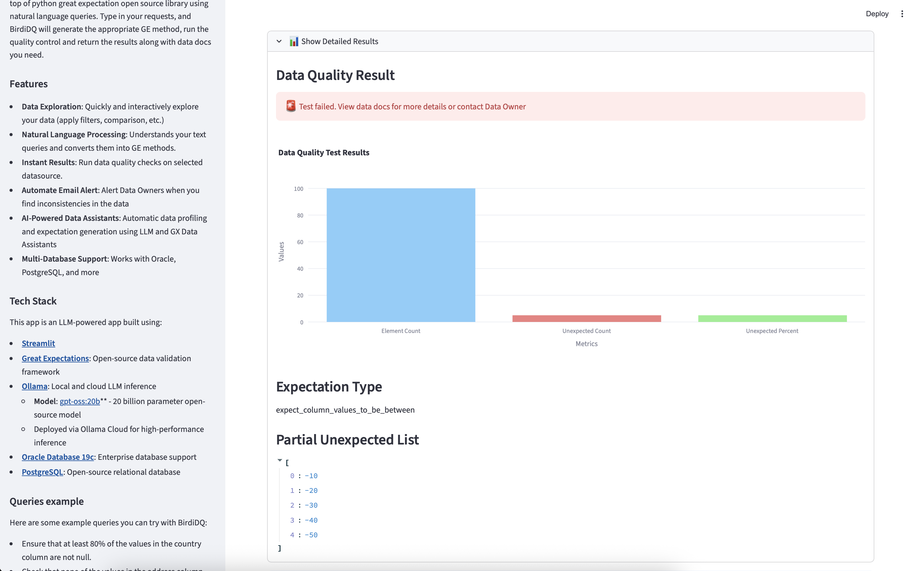
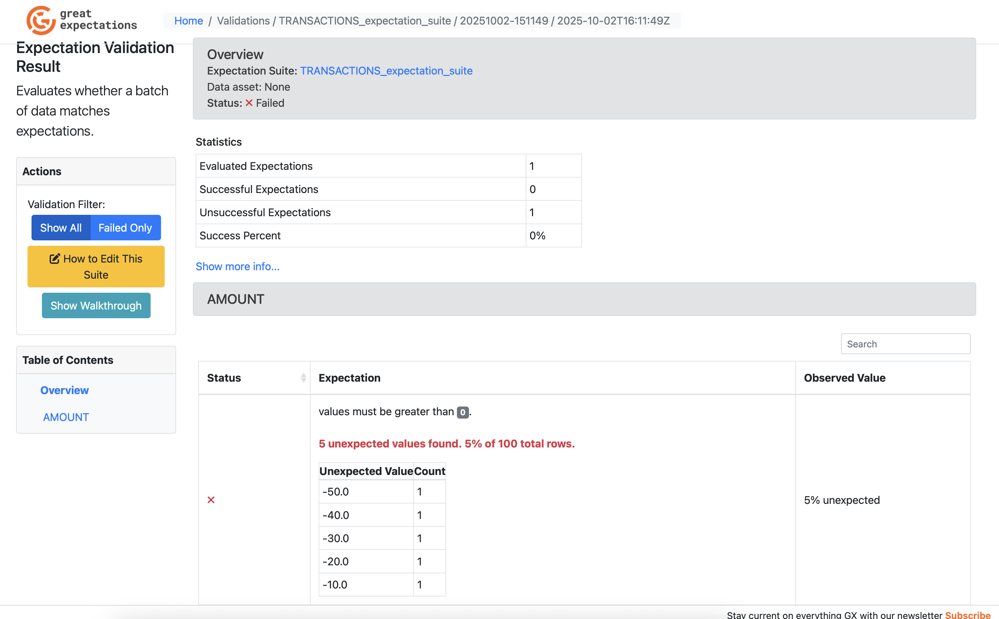
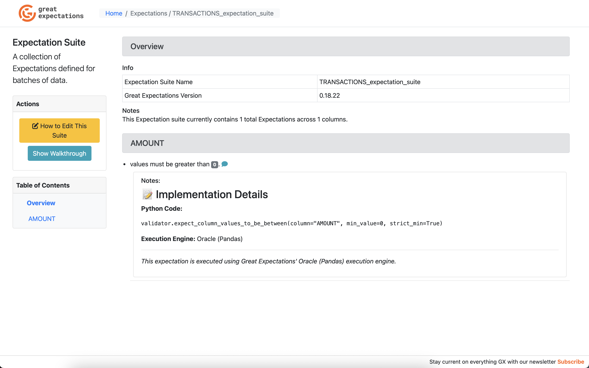

# BirdiDQ Application Workflow Guide

This guide demonstrates the complete workflow for using the BirdiDQ Streamlit application for natural language data quality validation.

## Overview

BirdiDQ provides an intuitive interface for running Great Expectations data quality checks using natural language queries. The workflow consists of 6 main steps:

1. **Select Database** - Choose your data source
2. **Select Table** - Pick the table to validate
3. **Preview Data** - Review your data structure
4. **Natural Language Input** - Describe validation rules in plain English
5. **Validation Results** - Review execution results
6. **Data Docs** - View comprehensive documentation

---

## Step-by-Step Workflow

### Step 1: Select Database



**Actions:**
- Launch the BirdiDQ Streamlit application
- From the sidebar, select your database type:
  - **PostgreSQL** - For PostgreSQL databases
  - **Oracle** - For Oracle databases
- The application connects to your configured database

**What Happens:**
- Application loads database connection from `.env` file
- Establishes connection to the selected database
- Prepares to list available tables

---

### Step 2: Select Table



**Actions:**
- Choose a table from the dropdown list
- Available tables are automatically populated from your database
- Examples shown:
  - PostgreSQL: `nyc_taxi_data`
  - Oracle: `TRANSACTIONS`

**What Happens:**
- Application queries database metadata
- Retrieves list of accessible tables
- Loads table schema information
- Prepares data preview

---

### Step 3: Data Preview



**What You See:**
- **Table Structure:**
  - Column names and data types
  - Sample rows from the table
  - Data statistics (row count, etc.)

- **Column Information:**
  - All available columns displayed
  - Data types shown
  - Null/non-null indicators

**Purpose:**
- Understand your data structure before creating validations
- Identify columns that need quality checks
- Review sample data to inform validation rules

---

### Step 4: Natural Language Input



**Actions:**
- Enter your validation requirements in plain English
- Click "Generate & Execute" button
- LLM converts natural language to GX expectations

**Example Inputs:**
```
"CUSTOMER_ID should not be null"
"AMOUNT should be greater than 0"
"passenger_count values should be between 1 and 6"
"email should match a valid email pattern"
```

**What Happens:**
1. **LLM Processing:**
   - Your natural language input is sent to Ollama LLM
   - Model converts text to Great Expectations expectation code
   - Returns valid Python code: `validator.expect_column_values_to_not_be_null(column="CUSTOMER_ID")`

2. **Code Execution:**
   - Generated code is executed against your data
   - Great Expectations runs the validation
   - Results are captured and displayed

3. **Code Enhancement:**
   - Python code is embedded in expectation metadata
   - SQL examples generated (for SQL execution engines)
   - Metadata prepared for Data Docs

---

### Step 5: Validation Results



**What You See:**

**Execution Summary:**
- Number of lines processed
- Successful expectations: ✓
- Failed expectations: ✗
- Detailed error messages (if any)

**Results Display:**
```
============================================================
EXPECTATION INPUT (raw):
validator.expect_column_values_to_not_be_null(column="CUSTOMER_ID")
============================================================
Parsed into 1 lines
Line 1: Attempting to execute:
  'validator.expect_column_values_to_not_be_null(column="CUSTOMER_ID")'
Calculating Metrics: 100%|██████████| 6/6 [00:00<00:00, 973.23it/s] 
  ✓ SUCCESS: Expectation executed and added to suite
    Validation result: False
============================================================
EXECUTION SUMMARY:
  Lines processed: 1
  Successful: 1
  Failed: 0
============================================================
Suite 'TRANSACTIONS_expectation_suite' now has 1 expectations
```

**Key Information:**
- ✅ **Success** - Expectation executed and added to suite
- ⚠️ **Validation Result** - `True` (data passes) or `False` (data fails)
- 📊 **Metrics** - Performance statistics
- 🗂️ **Suite Status** - Number of expectations in suite

**Checkpoint Execution:**
```
Running checkpoint 'TRANSACTIONS_checkpoint' to validate expectations...
Calculating Metrics: 100%|██████████| 10/10 [00:00<00:00, 814.19it/s]
✓ Checkpoint executed: False
✓ Validation results saved to Data Docs
```

---

### Step 6: Data Docs



**What You See:**

**Comprehensive Documentation:**
- **Expectation Suite Details**
  - All expectations listed
  - Parameters and configurations
  - Pass/fail status for each

- **Implementation Details** (Custom Enhancement)
  - **Python Code:**
    ```python
    validator.expect_column_values_to_not_be_null(column="CUSTOMER_ID")
    ```
  
  - **SQL Example** (for SQL engines):
    ```sql
    SELECT COUNT(*) 
    FROM table_name 
    WHERE CUSTOMER_ID IS NULL;
    ```
  
  - **Execution Engine:** Oracle (Pandas) or PostgreSQL (SQL)

- **Validation Results**
  - Observed values vs expected
  - Success percentage
  - Unexpected values (if any)
  - Element count and missing count

- **Visual Elements**
  - Color-coded pass/fail indicators
  - Statistical charts
  - Data profiling results

**Accessing Data Docs:**
- Click "Open Data Docs" button in the Streamlit app
- Opens in your default web browser
- Interactive HTML documentation
- Shareable with team members

---

## Workflow Summary

| Step | Action | Output |
|------|--------|--------|
| 1. **Select Database** | Choose PostgreSQL or Oracle | Database connection established |
| 2. **Select Table** | Pick table from dropdown | Table metadata loaded |
| 3. **Preview Data** | View sample rows | Data structure understood |
| 4. **Natural Language** | Enter validation requirements | LLM generates GX code |
| 5. **Results** | Code executes | Validation results displayed |
| 6. **Data Docs** | Open documentation | Professional HTML reports |

---

## Key Features Demonstrated

### 🤖 AI-Powered Validation
- **Natural Language Processing** - No GX syntax knowledge required
- **Ollama Integration** - Uses `gpt-oss:20b` model for code generation
- **Error Handling** - Clear feedback on invalid inputs

### 🔧 Technical Capabilities
- **Multiple Databases** - PostgreSQL and Oracle support
- **Real-time Execution** - Immediate validation results
- **Code Display** - Shows both Python and SQL in Data Docs
- **Metadata Enhancement** - Custom implementation details embedded

### 📊 Professional Output
- **Custom Data Docs** - Enhanced with code display
- **Execution Engine Labeling** - Clear indication of validation method
- **Comprehensive Reporting** - Statistics, metrics, and visual feedback

---

## Tips for Best Results

### Natural Language Input
✅ **Good Examples:**
```
"column_name should not be null"
"column_name should be between 1 and 100"
"column_name should match email pattern"
"column_name should be unique"
```

❌ **Avoid:**
```
"check if data is good"  (too vague)
"validate everything"    (not specific)
"fix the data"          (not a validation rule)
```

### Handling Errors
If validation fails:
1. Check column names are correct
2. Verify data types match expectations
3. Review terminal output for syntax errors
4. Simplify complex requirements into multiple expectations
5. Try using Data Assistants for automatic profiling

### Performance
- **PostgreSQL** - Uses SQL execution (faster for large datasets)
- **Oracle** - Uses Pandas execution (loads data into memory)
- Start with simple expectations before complex rules
- Use Data Assistants for comprehensive automated profiling

---

## Next Steps

After completing the workflow:

1. **Refine Expectations** - Add more validation rules
2. **Schedule Checkpoints** - Automate validation runs
3. **Share Data Docs** - Distribute reports to stakeholders
4. **Integrate with CI/CD** - Add to data pipelines
5. **Monitor Data Quality** - Track trends over time

---

## Troubleshooting

### Common Issues

**"No expectations were successfully executed"**
- LLM generated invalid Python code
- Try simpler, more specific language
- Use Data Assistants for automatic generation

**"Syntax Error in expectation"**
- Generated code has syntax issues
- Manually enter the expectation code
- Report issue for LLM fine-tuning

**"Database connection failed"**
- Check `.env` file configuration
- Verify database credentials
- Ensure database is accessible

**"Validation result: False"**
- Data **does not** meet the expectation
- This is **expected behavior** if data has quality issues
- Review Data Docs for detailed failure information

---

## Additional Resources

- **Great Expectations Docs:** https://docs.greatexpectations.io/
- **Ollama Documentation:** https://ollama.com/docs
- **BirdiDQ Documentation:** [BirdiDQ/README.md](BirdiDQ/README.md)
- **Project README:** [README.md](README.md)

---

**Last Updated:** October 2025  
**Version:** 2.0 (Enhanced with Code Display Feature)

